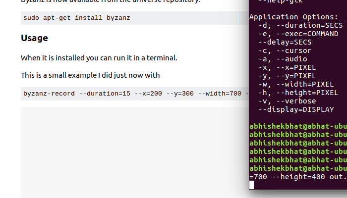
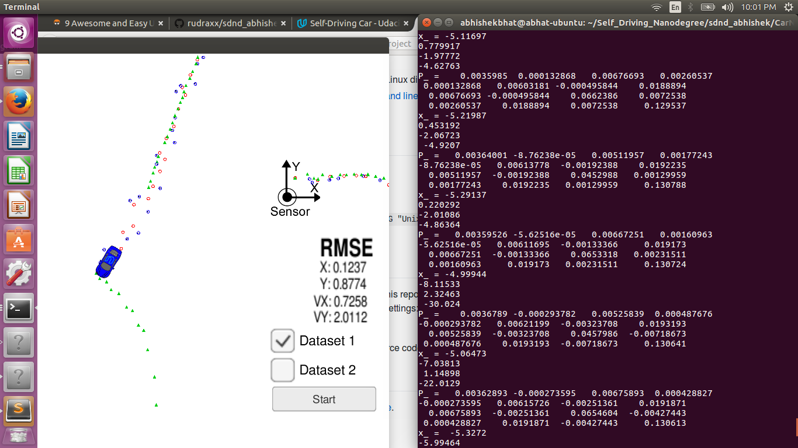

# Extended Kalman Filter
---
## ** Implement Sensor Fusion for Radar and Lidar data in C++ ** ##

The goals of this project are:
* Implement predict/correct equations for Extended Kalman filter.
* Compute Jacobian matrices and rmse error.
* Use Eigen library for matrix operations.  
* Validate estimator using Unity gaming engine simulator.  

I have also added 2 sections at the bottom:
* Lessons learnt.
* What's next? How can we improve these results?

Before jumping into the details, I'd like to show you how the end results look like.

As you notice, the ekf output is tracking the ground truth better than the individual lidar or radar measurements.


## Rubric Points
Here I will consider the rubric points individually and describe how I have addressed each point in my implementation:

### Compiling
The cmake and make files work. Was able to build and run the model.

### Accuracy
According to the rubric, the rmse values should be within a given range. I have tabulated my results with the target values.

|State Var| Target RMSE | Fusion EKF |Radar only| Lidar only|
|---------|-------------|-----|----------|-----------|
|px|0.11| 0.0974|0.2304|0.1473|
|py|0.11| 0.0856|0.3480|0.1153|
|vx|0.52| 0.4517|0.5841|0.6383|
|vy|0.52| 0.4404|0.8054|0.5346|

### Follows the correct algorithm

#### Your Sensor Fusion algorithm follows the general processing flow as taught in the preceding lessons.

The fusion algorithm follows the following steps:
1) Acquires the measurement.

2) Determine if the data is coming from Lidar or Radar.

3) Calcuate the time difference between current time and previous measurement.

4) Based on the delta time, invoke the ```EKF::Predict``` function to get the a-priori estimate of the mean and covariance.

5) If the measurement came from lidar, call the ```EKF::Update``` function.

6) If the measurement came from radar, call the ```Tools::CalculateJacobian``` function to get the Hj matrix at current mean estimate, and then call the ```EKF::UpdateEKF``` function.

7) Step 4/ Step 5 will update the new estimates.

If takes the current measurments and the  

#### Your Kalman Filter algorithm handles the first measurements appropriately.

If the radar measurement comes in first, then the states px and py are initialized as :

```
float term1 = measurement_pack.raw_measurements_[0] * cos(measurement_pack.raw_measurements_[1]);
float term2 = measurement_pack.raw_measurements_[0] * sin(measurement_pack.raw_measurements_[1]);

```

#### Your Kalman Filter algorithm first predicts then updates.

If you notice in FusionEKF.cpp, line 185 calls the EKF::Predict function, followed by EKF::Update or EKF::UpdateEKF depending upon the input measurement type, which can be radar or lidar.


### Code Efficiency
Have tried to ensure that we don't have repeat calculations.

For example, in the Tools::CalculateJacobian, we pre-compute some of the terms, so that we don't redo the calculations again and again.

## Additional Section:
### Lessons Learnt:
1) During an intermediate step, I had forgotten to wrap the theta angle in between -pi to pi. As a result, my data for velocity at a particular place was going wildly incorrect.


If you notice, the position was getting all messed up because of incorrect velocity estimate.(Notice the off path green dots in the middle) For debugging, I recorded the measurements and estimates to a file using fstream class.

Here is what one of the recorded lines in the file looked like:

```time 1477010456650000 R 6.00513 3.19003 1.77637  end meas -4.99944 	 -8.11533 	 2.32463 	 -30.024``` 	 

The second value after R is the measured angle, and the last value is the vy velocity. Comparing this line with data from previous time step helped me realize that I had forgotten the angle normalization. Once that was resolved, the EKF worked as expected.

2) Sensor fusion provides better results than any individual sensor. As tabulated in the rmse table,


|State Var| Target RMSE | Fusion EKF |Radar only| Lidar only|
|---------|-------------|-----|----------|-----------|
|px|0.11| 0.0974|0.2304|0.1473|
|py|0.11| 0.0856|0.3480|0.1153|
|vx|0.52| 0.4517|0.5841|0.6383|
|vy|0.52| 0.4404|0.8054|0.5346|

  we can see that the radar only and lidar only systems perform worse than the fusion system. So the overall system improves as compared to single sensor system.

### What's next?
1. **Faulty measurement handling:** It seems like the EKF is being triggered to run only when input measurements are received. But there are conditions where maybe the measurement data is faulty, and I want to discard that reading. That is currently not taken into account. I will be adding some code for checking the range of measurements and then discarding some if necessary.

2. **Deterministic behavior:** The algorithm isn't running in a deterministic  fashion. Doesn't seem to be triggered periodically. I would want the algorithm to keep on estimating the position even if no measurement is received. The uncertainty might go up with passage of time, but the closed loop control system will still receive a new estimate as opposed to old one.
