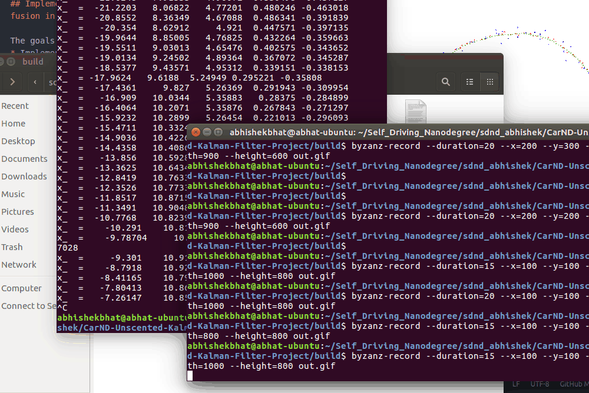
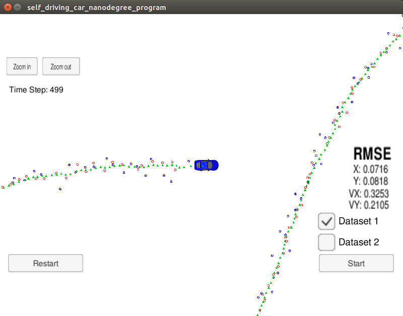
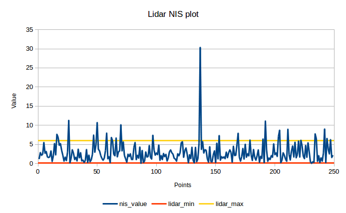
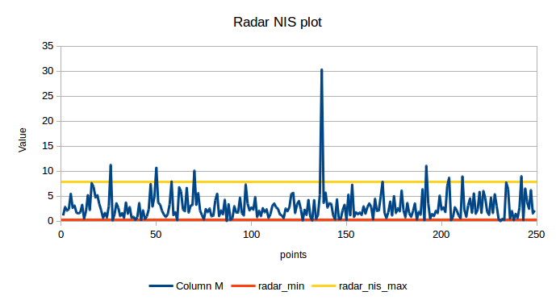
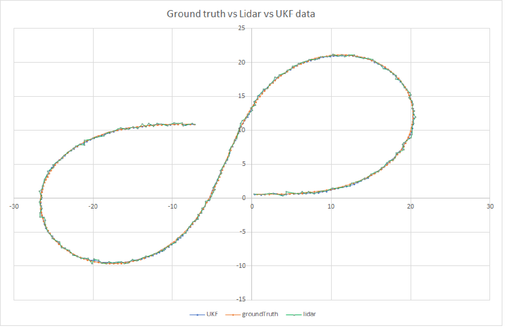
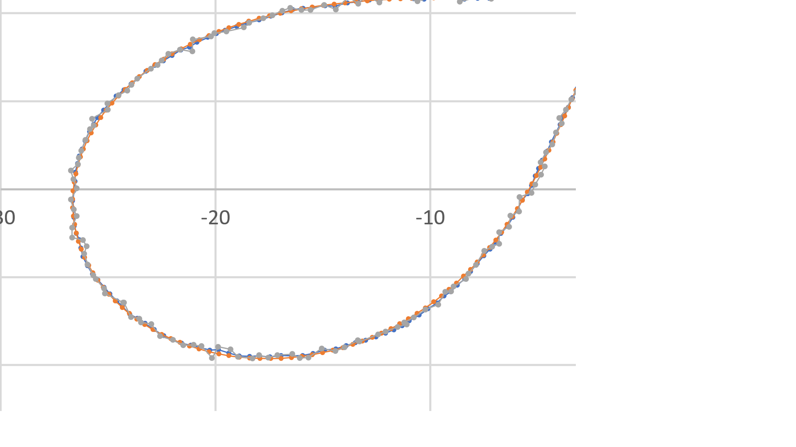

# Unscented Kalman Filter
---
## Implement Unscented Kalman Filter for Radar and Lidar sensor fusion in C++ ##

The goals of this project are:
* Implement predict/correct equations for Unscented Kalman filter.
* Compute sigma points using CTRV motion model.
* Tune plant noise parameters and evaluate performance using Normalized Innovation Square (NIS).  
* Validate estimator using Unity gaming engine simulator.  

I have also added 2 sections at the bottom:
* Lessons learnt.
* What's next? How can we improve these results?

Before jumping into the details, I'd like to show you how the end results look like.


As you notice, the ekf output is tracking the ground truth better than the individual lidar or radar measurements.

For recoring a gif on ubuntu 16.04, i used the byzanz package:

``` "byzanz-record --duration=15 --x=100 --y=100 --wid
th=1000 --height=800 out.gif" ```

## Rubric Points
Here I will consider the rubric points individually and describe how I have addressed each point in my implementation:

### Compiling
The cmake and make files work. Was able to build and run the model.

### Accuracy
According to the rubric, the rmse values should be within a given range. I have tabulated my results with the target values.

|State Var| Target RMSE | EKF |UKF|
|---------|-------------|-----|---|
|px|0.09| 0.0974|0.0713|
|py|0.10| 0.0856|0.0818|
|vx|0.40| 0.4517|0.3253|
|vy|0.30| 0.4404|0.2105|


### Follows the correct algorithm

#### Your Sensor Fusion algorithm follows the general processing flow as taught in the preceding lessons.

The fusion algorithm follows the following steps:
1) Acquires the measurement.

2) Determine if the data is coming from Lidar or Radar.

3) Calcuate the time difference between current time and previous measurement.

4) Based on the delta time, invoke the ```UKF::Predict``` function which will be used to calculate sigma points for augmented states, predict new states based on the CTRV model and gaussian noise.
5) Calculate the predicted mean and covariance of the predicted sigma points.  

6) If the measurement came from lidar, call the ```UKF::UpdateLidar``` function, and ```UKF::UpdateRadar``` if the measurement came from radar.

7) At the end of the measurment update, calculate the normalized innovation squared (NIS) to see if the process noise needs to be tuned.

Lidar plot:

Radar plot:


#### Your Kalman Filter algorithm handles the first measurements appropriately.

If the radar measurement comes in first, then the states px and py are initialized as :

```x_(0) = meas_package.raw_measurements_[0] * cos(meas_package.raw_measurements_[1]);
x_(1) = meas_package.raw_measurements_[0] * sin(meas_package.raw_measurements_[1]);
```

#### Your Kalman Filter algorithm first predicts then updates.

If you notice in ukf.cpp, line 138 calls the UKF::Prediction function, followed by UKF::UpdateLidar or UKF::UpdateRadar depending upon the input measurement type, which can be radar or lidar.


### Code Efficiency
Have tried to ensure that we don't have repeat calculations.

Additional snapshots of the UKF in action:





## Additional Section:
### Lessons Learnt:
1) During an intermediate step, my code was hanging up after a few timesteps. In order to debug this, I used multiple ```std::cout``` and logging to text file using fstream library.

The reason the code was hanging is that while calculating the P value at line 273 - 279, the P covariance matrix should be reinitialized to 0 for every new measurement. I didnt catch this because we don't do this for a regular linear kalman filter, nor did we have to do this for EKF. But this makes sense, since we are calculating the covariance matrix in a slightly different fashion. Lesson learnt!

2) UKF result seem to be better than EKF al across the board. I'd however like to check how much extra computation power is needed. Not sure how to check that just yet for C++.

|State Var| Target RMSE | EKF |UKF|
|---------|-------------|-----|---|
|px|0.09| 0.0974|0.0713|
|py|0.10| 0.0856|0.0818|
|vx|0.40| 0.4517|0.3253|
|vy|0.30| 0.4404|0.2105|


### What's next?
1. I want to run a parameter sweep on the varius values. I tried doing this by setting up input arguments, and then using a loop in the main function. But I still have to manually put all this data in excel and visualize it. I plan to save multiple log files, and then use MATLAB for automating the whole proessing. Lets see how that goes!
